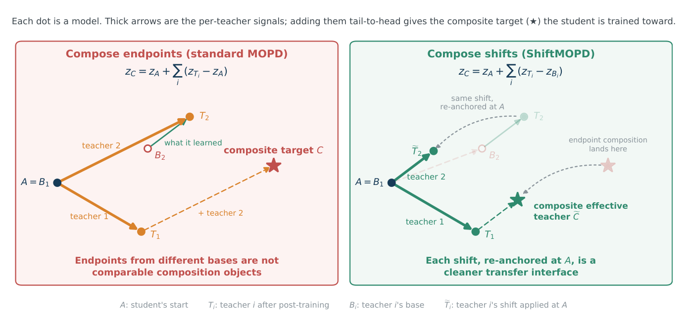
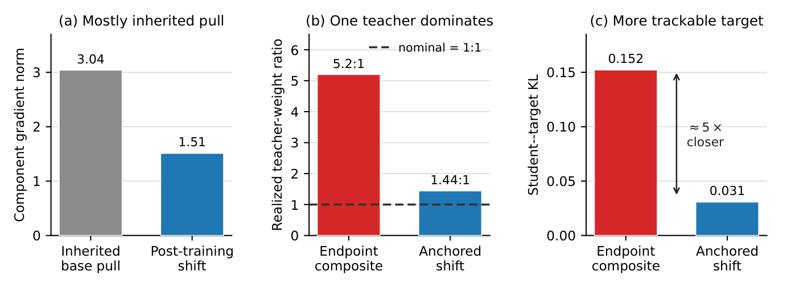

# Δ-MOPD

Research code for **Composing What Each Teacher Learned: Multi-Teacher On-Policy
Distillation through Teacher-Relative Shifts**.

[Paper (arXiv:2610.10460)](https://arxiv.org/abs/2610.10460) ·
[PDF](https://arxiv.org/pdf/2610.10460) ·
[Models](#models) · [Datasets](#datasets) ·
[Serving recipes](recipes/README.md) ·
[Implementation contract](docs/advanced/shiftmopd-final-draft.md) ·
[Scorer deployment](docs/scoring.md) ·
[Diagnostics](docs/advanced/shiftmopd-paper-diagnostics.md)

This repository contains our Miles-based MOPD and **Δ-MOPD** implementation.
This is a **research preview**. CPU correctness tests are available; the new
paper-aligned execution path still needs production SGLang numerical-parity,
GPU throughput, and multi-rank validation. This is not yet a turnkey
reproduction of every experiment in the paper.

## Motivation

A post-trained teacher contains both its precursor's behavior and changes learned
during post-training. Δ-MOPD transfers the teacher-relative changes while
anchoring the target to the student's initial model. The endpoint control instead
composes teachers relative to that same student anchor.



*Figure 1 from the [paper](https://arxiv.org/pdf/2610.10460v1#page=3).
The original artwork retains the earlier “ShiftMOPD” label for Δ-MOPD.*

Let `A` be the frozen initial student, `T_i` a frozen expert, `B_i` its exact
pre-post-training precursor, and `S` the selected teachers. On each
student-generated token prefix, the two target scores are:

```text
MOPD endpoint: z_endpoint = z_A + sum_{i in S}(z_Ti - z_A)
Δ-MOPD:        z_shift    = z_A + sum_{i in S}(z_Ti - z_Bi)
```

Normalize the target scores to obtain `q`. With one selected teacher, the endpoint
target reduces to that teacher. If every precursor equals the anchor, the two
targets coincide. Teacher selection (`all` or `routed`) is independent of target
construction and must be matched across a controlled comparison.

Both arms use the **same sampled-token score-function loss**:

```text
reward      = log q(sampled_token) - log p_old_student(sampled_token)
baseline    = mean reward over valid response tokens in the optimizer batch
token_loss  = -stop_gradient(reward - baseline) * log p_student(sampled_token)
loss        = mean over responses of their mean valid-token loss
```

The paper path uses batch centering, **not variance whitening**, candidate-weighted
top-K losses, or PPO clipping. Top-K, when explicitly enabled, approximates the
target partition only; it does not replace the sampled-token loss.

## Paper figures



*Figure 2 from the [paper](https://arxiv.org/pdf/2610.10460v1#page=5), illustrating
inherited-base pull, teacher-term balance, and target distance in the mechanism
experiment. These are published paper measurements, not a new evaluation of
this Miles snapshot.*

Both images are extracted from the original PDF. See
[figure attribution and provenance](assets/paper/README.md).

## Models

Primary checkpoints used in the paper:

| Role | Hugging Face checkpoint | Precursor for the teacher's shift |
|---|---|---|
| Student initialization and frozen anchor | [deepseek-ai/DeepSeek-R1-Distill-Qwen-1.5B](https://huggingface.co/deepseek-ai/DeepSeek-R1-Distill-Qwen-1.5B) | — |
| Cross-origin math expert | [POLARIS-Project/Polaris-7B-Preview](https://huggingface.co/POLARIS-Project/Polaris-7B-Preview) | DeepSeek-R1-Distill-Qwen-7B |
| Polaris precursor | [deepseek-ai/DeepSeek-R1-Distill-Qwen-7B](https://huggingface.co/deepseek-ai/DeepSeek-R1-Distill-Qwen-7B) | — |
| Same-origin Science/IF expert | [nvidia/Nemotron-Research-Reasoning-Qwen-1.5B (v1)](https://huggingface.co/nvidia/Nemotron-Research-Reasoning-Qwen-1.5B/tree/v1) | DeepSeek-R1-Distill-Qwen-1.5B |
| Additional same-origin math expert | [hbx/JustRL-DeepSeek-1.5B](https://huggingface.co/hbx/JustRL-DeepSeek-1.5B) | DeepSeek-R1-Distill-Qwen-1.5B |

Use the exact revisions recorded in the
[model manifest](experiments/final_draft_model_manifest.example.json), not moving
`main` revisions. These links point to the public source checkpoints, not newly
trained Δ-MOPD outputs. Appendix F's cross-tokenizer extension is not implemented
in this Miles snapshot.

## Datasets

### Training sources

| Domain | Hugging Face dataset | Use |
|---|---|---|
| Math | [SynthLabsAI/Big-Math-RL-Verified](https://huggingface.co/datasets/SynthLabsAI/Big-Math-RL-Verified) | BigMath prompt pool |
| Science | [MegaScience/TextbookReasoning](https://huggingface.co/datasets/MegaScience/TextbookReasoning) | Routed Science prompts |
| Instruction following | [nvidia/Llama-Nemotron-Post-Training-Dataset](https://huggingface.co/datasets/nvidia/Llama-Nemotron-Post-Training-Dataset) | `RL/instruction_following` subset |

### Evaluation benchmarks

| Benchmark | Hugging Face dataset |
|---|---|
| AMC 2023 | [knoveleng/AMC-23](https://huggingface.co/datasets/knoveleng/AMC-23) |
| MATH-500 | [HuggingFaceH4/MATH-500](https://huggingface.co/datasets/HuggingFaceH4/MATH-500) |
| AIME 2025 | [math-ai/aime25](https://huggingface.co/datasets/math-ai/aime25) |
| GPQA Diamond | [fingertap/GPQA-Diamond](https://huggingface.co/datasets/fingertap/GPQA-Diamond) |
| IFEval | [google/IFEval](https://huggingface.co/datasets/google/IFEval) |

These are source dataset links, not a release of the paper's processed, frozen
item manifests. Preserve dataset revisions, sampled IDs, preprocessing, and
verifier versions for comparisons; a current download is not automatically
identical to the experiment's frozen data. Follow each dataset's license and
access requirements. The [implementation contract](docs/advanced/shiftmopd-final-draft.md)
documents evaluation settings.

## Training configuration

Two executable, dry-run-first serving recipes are included:

1. **[Standalone teacher engines](recipes/standalone/README.md):** separate
   full-checkpoint servers for the paper's experts, with frozen base and anchor
   reuse where identities match.
2. **[Multi-LoRA teacher engine](recipes/multi_lora/README.md):** one shared
   base with named expert adapters, plus the frozen student anchor. This requires
   genuine same-base adapters; it cannot combine the paper's 1.5B and 7B experts
   into one base engine.

Both use the same launcher, preserve exact student token IDs, and emit routing
arguments for either MOPD or Δ-MOPD. They launch scorers, not an entire training
cluster. See [shared setup and validation](recipes/README.md).

Select **`--opd-objective paper`** explicitly: the inherited runtime otherwise
defaults to `legacy`. Historical runs are not relabeled as paper reproductions.

Training requires a compatible Linux CUDA environment with Miles' SGLang and
Megatron dependencies. Install this source into that provisioned environment
with `python -m pip install -e . --no-deps`; this command does **not** install or
validate those GPU dependencies. See [upstream Miles](https://github.com/radixark/miles)
for framework/environment setup and [provenance](PROVENANCE.md) for this snapshot.

1. Download and pin the student, frozen anchor, experts, and exact precursors.
   Fill local paths in the [example manifest](experiments/final_draft_model_manifest.example.json).
2. Provision SGLang scoring routes and verify their checkpoint/adapter identities.
   Both standalone and shared-base multi-LoRA layouts are supported; see
   [scoring.md](docs/scoring.md).
3. Provision frozen training/evaluation data and official verifiers. Data and
   weights are not bundled in this repository.
4. Use synchronous `train.py`, the paper argument fragments in the
   [implementation contract](docs/advanced/shiftmopd-final-draft.md), and the same
   seed, data order, teacher selection, sampling, batch size, update budget,
   optimizer, partition, and evaluation protocol for both arms.
5. Change only `--opd-target-mode endpoint` to `--opd-target-mode shiftmopd`
   (the CLI value retains its historical name; this selects **Δ-MOPD**)
   for the controlled target comparison. Run GPU parity and a short smoke test
   before a full experiment.

The paper path currently requires training TP=CP=1, one optimizer batch per
rollout, temperature 1, top-p 1, no sampling top-K truncation, zero dropout,
and no additional task/KL/entropy objective. Set
`MILES_USE_LEGACY_ROLLOUT_V1=1` for its supported rollout integration.
`train_async.py` is retained for other Miles workflows but is **not supported**
by the paper objective. Do not bypass the preflight checks.

Full normalization uses 151,665 effective tokens for the draft's aligned
tokenizers. It streams vocabulary blocks through the scoring API and is a slow
correctness reference. Restricted support requires an explicit K and must be
labeled as an approximation; the paper does not prescribe one universal training
K. Diagnostic top-16 is separate from training support and decoding top-K.

Configure W&B through your environment (`WANDB_API_KEY`) and the normal Miles
tracking arguments. Never put credentials, private deployment addresses, run
logs, model weights, or evaluation traces into Git.

## Citation and acknowledgments

```bibtex
@article{sang2026deltamopd,
  title={Composing What Each Teacher Learned: Multi-Teacher On-Policy
         Distillation through Teacher-Relative Shifts},
  author={Sang, Hejian and Zhou, Zhengze and Hamidi, Shayan Mohajer and
          Li, Xiaomin and Jain, Rohit and Geramifard, Alborz},
  journal={arXiv preprint arXiv:2610.10460},
  year={2026}
}
```

Built on [Miles](https://github.com/radixark/miles), with SGLang for rollout and
scoring. Existing upstream copyright notices and the
[Apache-2.0 license](LICENSE) are retained. See [PROVENANCE.md](PROVENANCE.md)
for local modifications and import scope. External models and datasets retain
their own licenses.
